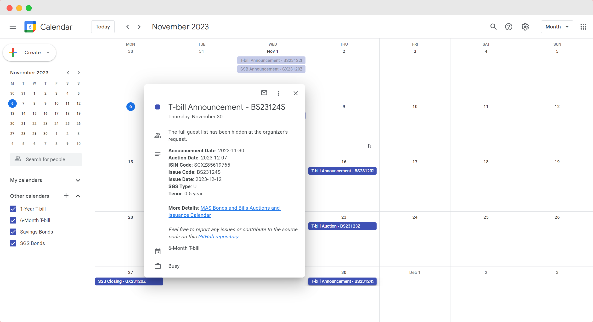

# sgs-issuance-calendar

A Google Apps Script project made to create Google Calendar events for [Singapore Government Securities (SGS)](https://www.mas.gov.sg/bonds-and-bills) based on [MAS Auctions and Issuance Calendar](https://www.mas.gov.sg/bonds-and-bills/auctions-and-issuance-calendar).

It retrieves SGS data such as SGS, SSB, and T-bills from MAS API and generates events of key dates related to SGS issuances.

  

## Usage

You can subscribe to the following calendars for Singapore Bonds and T-bills to stay updated with important dates:

| Calendar                | Link                                                                                                                                                                                  |
| ----------------------- | ------------------------------------------------------------------------------------------------------------------------------------------------------------------------------------- |
| SGS Bonds Calendar      | [Add calendar](https://calendar.google.com/calendar/u/0?cid=MWU3MDlkZjY5OTlhOWNjOGIxYTJiYTRlMDQ5ZDBmZDM0ZTBhNjQ5OTRhNTU5MzRmYTMzMzk3NTM0NWE5YjAzMEBncm91cC5jYWxlbmRhci5nb29nbGUuY29t) |
| 6-Month T-Bill Calendar | [Add calendar](https://calendar.google.com/calendar/u/0?cid=NzFkNTAyMDBjMDA4OTNiZjAyOWIxYjVhZDdmMjM4OGZkODU0ODA3YzdlMWJmYTFiM2E0OWI5MTNkNjAzMDUwYUBncm91cC5jYWxlbmRhci5nb29nbGUuY29t) |
| 1-Year T-Bill Calendar  | [Add calendar](https://calendar.google.com/calendar/u/0?cid=NDcxNzZkMTIwZWZiM2M4OTM1OTIxZTgxNmM3YzUzMGY4N2ExNmM0NThjNGFiYTQyZjljZWRkNTE4NWZmNDgzM0Bncm91cC5jYWxlbmRhci5nb29nbGUuY29t) |
| Savings Bond Calendar   | [Add calendar](https://calendar.google.com/calendar/u/0?cid=NDY1MjEwOGViZTU5YjAyZmE3MTdkNmM3NzU5MmNkZjcyNmJlNDgwM2NlM2M2ZmJhOTM5ZGY5ZTI3Nzg3YTY3NEBncm91cC5jYWxlbmRhci5nb29nbGUuY29t) |

> **NOTE**:
> The calendar details are updated every month.

## FAQ

Check out these [FAQs](docs/FAQ.md).

## Contributing

If you want to contribute or report an issue, please read the instructions in [contributing guidelines](docs/CONTRIBUTING.md).

## License

This project is licensed under the [MIT License](LICENSE).

## Disclaimer

The `sgs-issuance-calendar` project is provided "as is" without any warranty. Use at your own risk. The authors and contributors are not liable for any damages or issues arising from the use of the project. This project does not provide legal or professional advice, and it may use third-party components subject to their terms and conditions.

Please review this disclaimer regularly for any updates.

By using the project, you agree to these terms.
